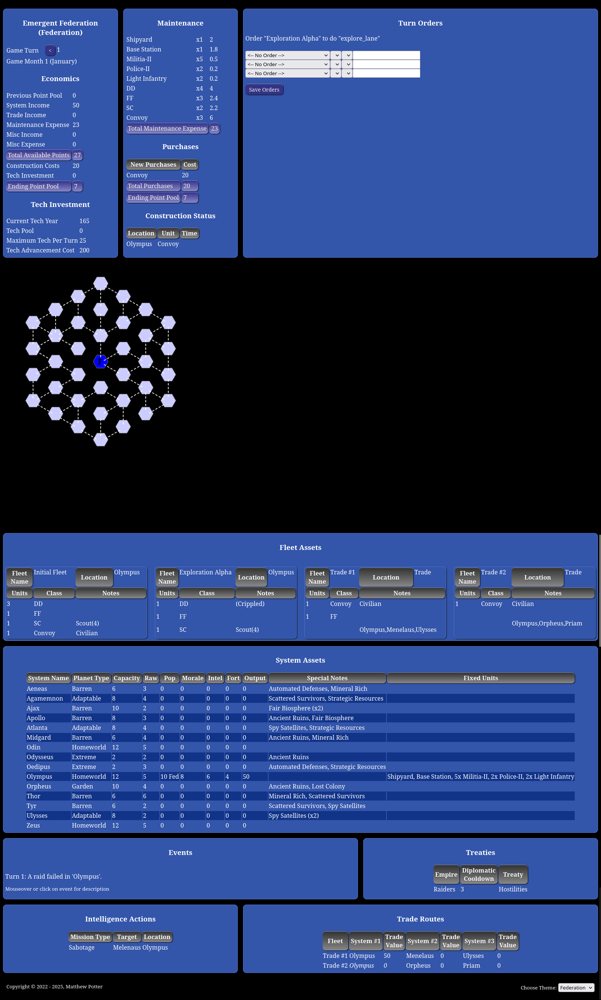

# Victory by Star Fleet
This project offers some automation to moderating a first-edition [Victory by any means](http://www.vbamgames.com) campaign game. The data set is based on the Star Trek wargame [Star Fleet Battles](http://starfleetgames.com).

In it's current form, This is geared towards a standard single-player game or a multi-player exploration style game. A Campaign Moderator (CM) is required, in order to handle the items that are not automated.

## What it does
* The player sheet displays all of the information that a player would normally see on the stock VBAM player sheets.

## What it will do
This list is necessarily fluid, since these are the items being added to the scripts.
* Tracking of trade fleets and their income.
* A movement system - A system that moves units to different systems, after checking for connectivity of the systems, treaty effects of that movement, and the catching hostile fleets passing each other.
* The handling of intelligence actions. Most, if not all, seem to be able to be coded
* Checking for units out of supply.
* Handle mothballed units.
* Convert units from one variant to another variant of the same base-hull
* Manage the effects of orbital bombardment and ground combat.
* Increase population and productivity
* Income added from colonies and previous turns
* Research advanced on the end of the year and deducting research spent if successful.
* Calculate Raids, all the way to determining how large the raiding force is
* Completion of unit construction
* Morale checks

## What it will not do
In effect, this is a list of things that are not in the vision of what this will automate.
* All optional rules provided - The aim is to provide automation for the full basic game. Some optional rules will be provided.
* Combat - There may be an attempt to handle an automated combat system, but the expected end-use will not use automation for combat resolution.

## Code requirements
The player sheets are in HTML, CSS, and javascript. They should probably be sourced from a website - if sourced from a local drive, recent browser "inovations" have shut down the ability to call in certain locally-sourced files to a webpage. If a person wanted to set up a local webserver, this should work fine.

The scripts used on the back-end are written in PHP with a few BASH scripts for dealing with corner-cases. The intended environment is a linux system, but it's plausable that it could be used in any environment that provided a [PHP engine](https://windows.php.net/download/) (ver 8.0+) and a BASH environment.

The libraries used by the code are [D3JS](https://d3js.org) and it's [HexBin](https://d3-graph-gallery.com/hexbinmap.html) module. Both are included, so there is no need to independantly fetch them.

## How to use the code
### Installation
The **sheet/** and **files/** directories (and files) are used by the player sheet. **orderForm.php** is used by the player sheet to add the player-entered orders to the data sheet. These should be sourced on a webserver.

The remaining files in the root directory are used for back-end moderation. They expect to be used from the PHP Command Line Interace. You should be able to use them from a normal terminal, if you have PHP-CLI installed.
### Program workflow
To initialize a game, create a data sheet for each player and store it in the **files/** directory. A sample data file is included in that directory for reference.
Execute **postTurn.php** on each player’s data sheet to process the current turn. This script performs the following operations:
* Executes all end-of-turn procedures on the existing sheet. (Out of supply, Construction, Technology upgrades, * *et.al.* *)
* Generates a new data sheet for the subsequent turn. Therefore, each completed data sheet represents the player’s game state at the conclusion of that turn.
* Executes all start-of-turn procedures on the newly generated sheet. (Economics, * *et, al.* *)

Players then access their new data sheets to submit orders for the next turn. To do this, they open **./sheet/index.html?data=** followed by the identifier of the data file. For security purposes, data filenames should not be easily predictable (for example, avoid * *bob-turn-1* *). A hashing or randomization scheme (e.g., * *hf93mdf7* *) is recommended to prevent unauthorized access to other players’ sheets.

After all players have submitted their orders, the moderator executes **postOrders.php** on each data sheet. This script processes the intermediate game logic that occurs between order submission and combat resolution. Once this step is complete, the system is ready to resolve any resulting combat operations.

During combat resolution, players issue “orders” through their data sheets to cripple, destroy, or transfer (capture) their units. The moderator then runs **postTurn.php** again to finalize the turn and generate the updated data sheets for the next cycle.

